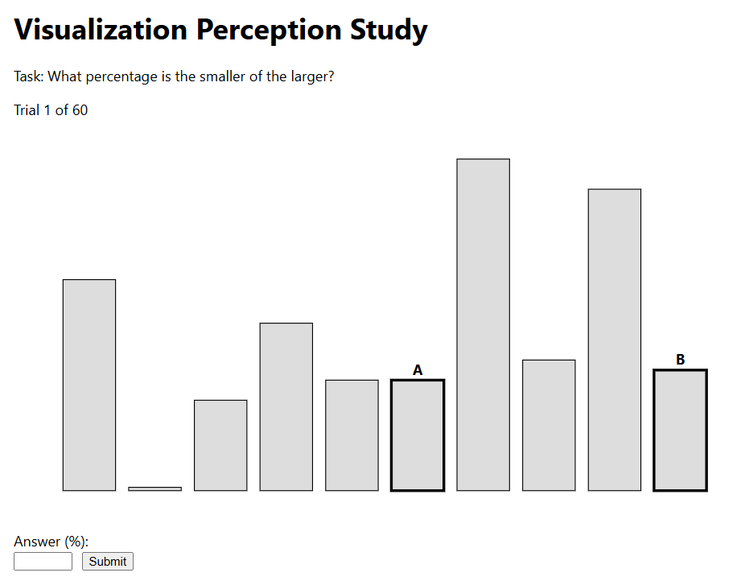
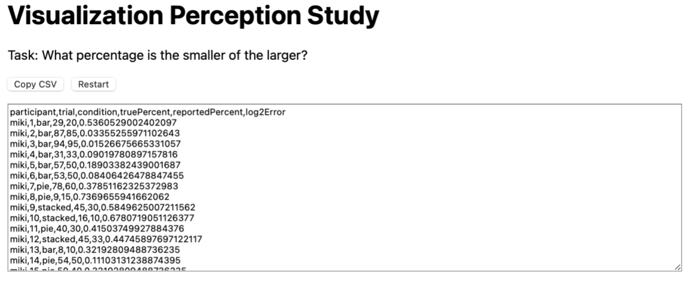
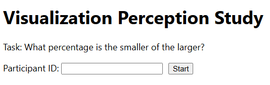
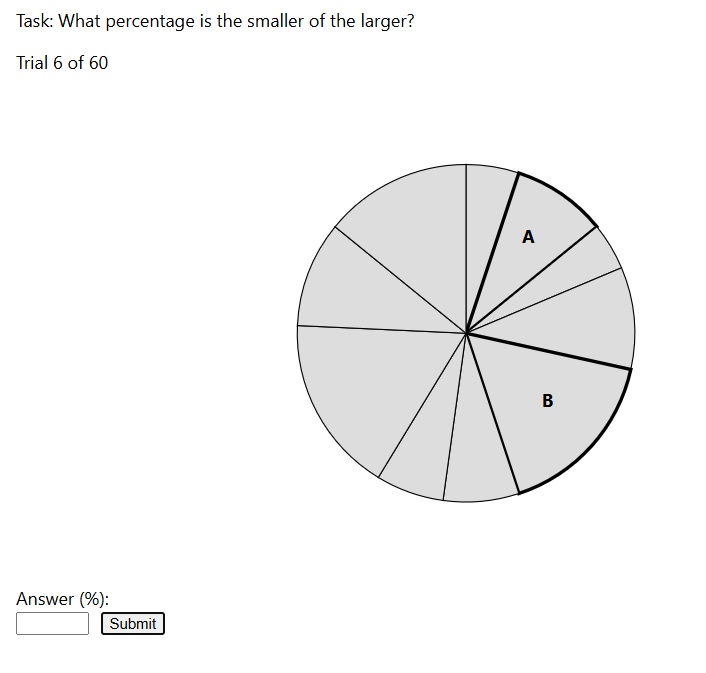
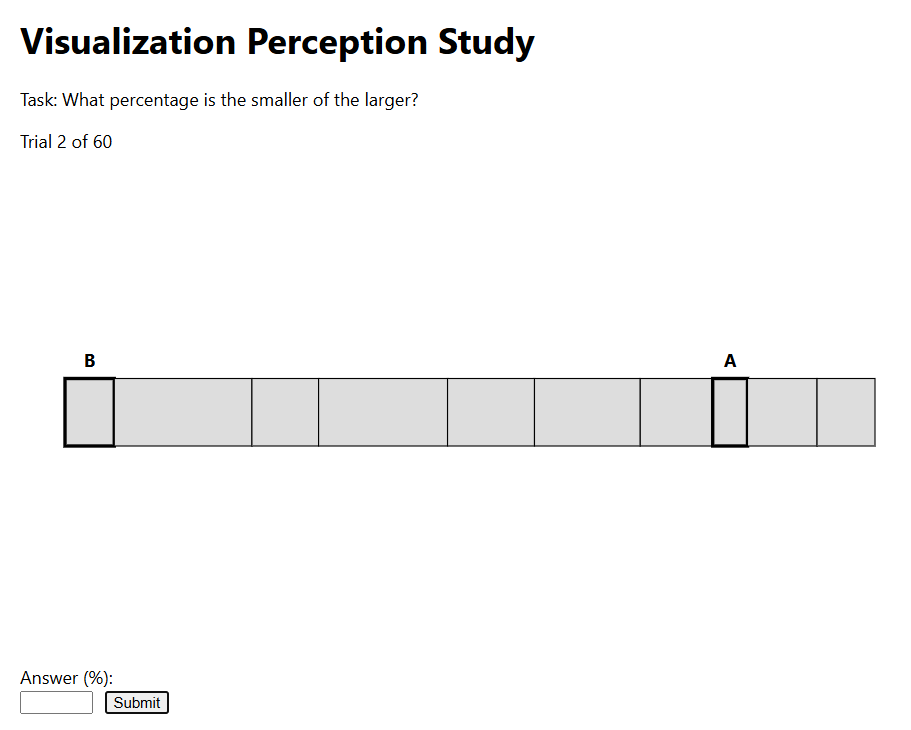
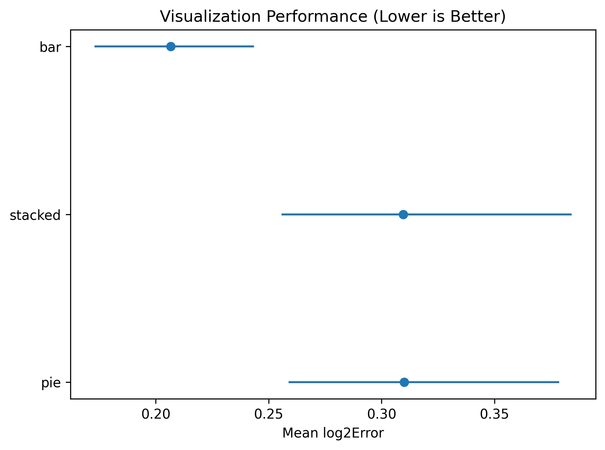

Assignment 3 - Experiment

Arjun Bhat, Leala Carbonneau, Jake DePietro, Krish Desai

Github Pages: https://lili-carbonn.github.io/a3-experiment/

Description: 
This project implements a browser-based visualization perception experiment that measures how accurately participants estimate ratios across different chart types. On each trial, participants view one of three visualizations (bar chart, pie chart, or stacked bar chart) displaying ten randomly generated values, with two values highlighted as A and B. The task is to estimate what percentage the smaller value is of the larger. The experiment records responses, computes log2 error, and exports results as a CSV for analysis. 

This screenshot represents the main page of the website that shows the bar chart. A and B are the two columns you are comparing, and you enter your estimate below the Answer(%). It shows a description of what the user is supposed to do, and it shows you what trial out of 60 you are on. 

This screenshot shows the final csv output of the program. We also added a copy csv button that will copy the whole text box of information, and also have a restart button, so that it is easy to restart the test for another person. 

This screenshot shows the first page of the webpage, which prompts the user to enter their Participant ID. This is used to track a person's results, and is later exported into the csv file data, so that each person's test results are able to be tracked. 

This screenshot represents the main page of the website that shows the pie chart. A and B are the two parts you are comparing, and you enter your estimate below the Answer(%). It shows a description of what the user is supposed to do, and it shows you what trial out of 60 you are on. 

This screenshot represents the main page of the website that shows the horizontal column chart. A and B are the two columns you are comparing, and you enter your estimate below the Answer(%). It shows a description of what the user is supposed to do, and it shows you what trial out of 60 you are on. 

This screenshot shows the error for each of the three different graphs. This is interesting and is honestly what I expected, as when I took the test, I found the bar test a noticeably easier to eyeball when compared to the stacked graph and the pie chart. 

Design Achievements  : 
For design achievements, we created a minimal interface with a single task, a clear focus, and low cognitive load. We tried to keep the A/B visual markings consistent across all the charts to avoid confusing the user. The website also gives you a progress bar that shows you what task you are on out of 60, so it makes it easier to understand how far the participant is. The answers are also restricted between 1-99, so the user can't add numbers that won't make sense (i.e., 0% or 200% don't make sense). After the trial is done, it will auto-generate a csv file on the webpage itself that you can copy and paste or download. The overall design is also a centered layout with a large chart area for readability. 

Technical Achievements  : 
For this assignment, we used the  D3.js  library and created three different rendering functions. We created a function for the Bar Chart, the Stacked Chart, and the Pie Chart. Each trial calls a shared render() function that selects the correct visualization based on the current condition. 

The charts are drawn directly in SVG using D3 scales, layout generators (pie chart), and manual segment calculations (stacked bar chart). We also added some constraints to the percentage input to ensure the user couldn't break the tests (the user cannot enter random letters or 100%). The program also produces a text box with the generated csv information, and allows for easy copying using the copy button in the gui.